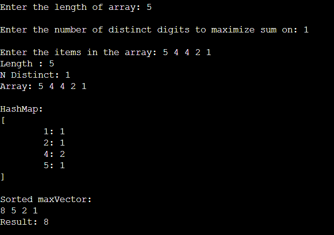

# Maximize sum
You are given an array **A** of **N** integers. You want to choose some integers from the array subject to the condition that the number of distinct integers chosen should not exceed **K**. Your task is to maximize the sum of chosen numbers. 

You are given **T** test cases.

Input format

The first line contains a single integer **T** denoting the number of test cases.
The first line of each test case contains two space-separated integers **N** and **K** denoting the length of the array and the maximum number of distinct integers you can choose.
The second line of each test case contains **N** space-separated integers denoting the integer array **A**.

