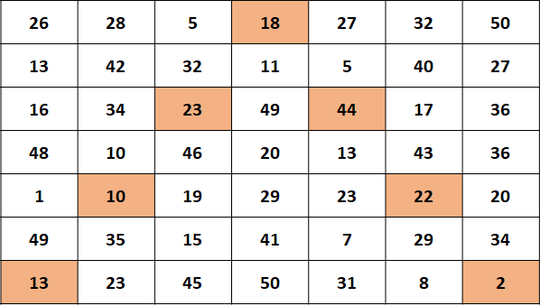

# Question

Perry has an important password to crack. Unfortunately, his arch-enemy has hidden this password in a 2D grid of size N x N:

These are the instructions given to you by Perry:  
The highlighted parts above are the generators. The rest of the grid is not useful, only the generators are. The generators are found by starting from bottom left corner, moving to middle of first row and then going to the bottom right corner again. All the while skipping one element. Refer to above image.
Thus, you will have N generators  
You have to collect the N generators, and form a string. Each generator corresponds to an alphabet  
The alphabet is obtained by from each generator. The number 1 corresponds to a, 2 to b and so on...  
If we get a number above 26, we will start assigning from a again. So 27 becomes a, 28 is b and so on...  
Combine the each of the alphabets and the resultant is your answer  
Thus, in the above case, we get the following N generators:  
13 10 23 18 44 22 2, which translate into: mjwrrvb  

### Explanation:

13 -> m, 10 -> j, 23 -> w, 18 -> r, 44 -> 18 -> r,
22 -> v, 2 -> b

Given an N and a grid, you must help Perry find the password.

Note: N is always odd and greater than 1. All numbers in the grid are greater than 0.

### Input

The first line contains T, the number of test cases. Following T lines contain:  
N and N, the size of the 2D grid. This is followed by N x N  numbers in a single line

### Output

Print each password in a single line

#### Sample Input

2  
3 3 16 13 4 16 13 19 23 8 11  
7 7 26 28 5 18 27 32 50 13 42 32 11 5 40 27 16 34 23 49 44 17 36 48 10 46 20 13 43 36 1 10 19 29 23 22 20 49 35 15 41 7 29 34 13 23 45 50 31 8 2  

#### Sample Output

wmk  
mjwrrvb

#### Explanation

The first case forms this grid:  
16 13 4  
16 13 19  
23 8 11  
Generators are 23 13 11 -> wmk  

The second case is the same as the one described in the image.  
